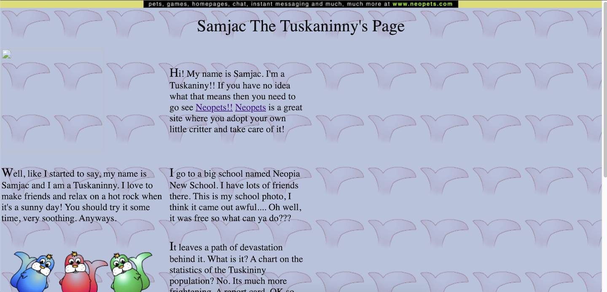

# neopets_archive
Maintenance and refactoring of a Neopets site I made as a teen.

## Goals
1. **Get it Here:** Move over existing code to source control
2. **Make it Work:** Site is broken after years of non-implemented HTML updates and lack of graphic maintenance. Adjust links and broken code to allow for user navigation.
3. **Make it Pretty:** Code was originally written in as as large single page chunks due to Neopets' limitations. Refactor and restructure existing code to follow design patterns.

## History
In November 1999, Neopets was launched, igniting a thrilling online realm where users could nurture virtual pets and engage in futuristic games. As a pre-teen, back in 2006, I eagerly joined this immersive world, signing up on my friend's antiquated desktop nestled within their sacred "computer room". What initially captivated me was the promise of an enthralling gaming experience, but little did I know that I would soon be entangled in the mesmerizing art of website creation.

Neopets bestowed upon its users the power to personalize their virtual pets' pages. These static web pages were originally intended as introductions to our beloved pets, showcasing their unique personalities. The provided template served as a mere starting point, effortlessly transformable to showcase any desired content (within Neopets' permissive guidelines). The catch was that we had only a solitary text input box at our disposal, but we were able to supply our HTML/CSS code without any character restrictions.

Enamored by this possibility, my focus shifted towards constructing a fully functional website. I poured my heart into crafting comprehensive tutorials, paired with meticulously designed layouts and graphics for users to help themselves to. My creation, aptly named **For You Tutorials**, aimed to provide fellow Neopians with a platform where they could learn and explore. As time passed, I delved deeper into this virtual universe, creating more virtual pets to enhance the organization of my site.

After a summer of relentless iterations and valuable feedback, I proudly unveiled a site that left every player awestruck. It became an instant hit, captivating the hearts and minds of all who beheld its splendor.

However, as the sands of time continued to flow, my involvement in the Neopets community gradually waned. Neopets would sporadically alter their rules concerning HTML and CSS, demanding swift adaptations. Although I attempted to keep up with these changes, eventually, the once-thriving "For You Tutorials" succumbed to neglect, its deterioration seemingly insurmountable.

Hence, the purpose of this repository is twofold: to migrate the code to a platform where the risk of sudden rule changes causing a catastrophic breakdown is minimized, and to embark on an iterative journey to resurrect the site to its former glory.
